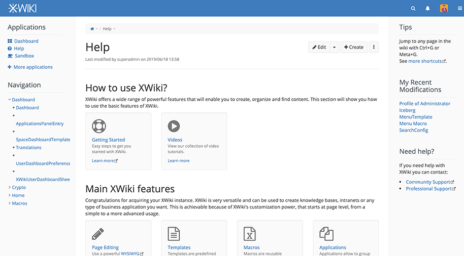

<!--
Важно: этот README был автоматически сгенерирован <https://github.com/YunoHost/apps/tree/master/tools/readme_generator>
Он НЕ ДОЛЖЕН редактироваться вручную.
-->

# XWiki для YunoHost

[](https://ci-apps.yunohost.org/ci/apps/xwiki/)  

[](https://install-app.yunohost.org/?app=xwiki)

*[Прочтите этот README на других языках.](./ALL_README.md)*

> *Этот пакет позволяет Вам установить XWiki быстро и просто на YunoHost-сервер.*  
> *Если у Вас нет YunoHost, пожалуйста, посмотрите [инструкцию](https://yunohost.org/install), чтобы узнать, как установить его.*

## Обзор

XWiki is an Open Source wiki engine (LGPLv2) suitable for use by workgroups (associations, companies, etc.). The software allows the rapid creation of small applications to meet different information management needs.

**Поставляемая версия:** 16.7.0~ynh1

**Демо-версия:** <https://playground.xwiki.org/xwiki/bin/view/Main/WebHome>

## Снимки экрана



## Документация и ресурсы

- Официальный веб-сайт приложения: <https://www.xwiki.org/>
- Официальная документация пользователя: <https://www.xwiki.org/xwiki/bin/view/Documentation/UserGuide/>
- Официальная документация администратора: <https://www.xwiki.org/xwiki/bin/view/Documentation/AdminGuide/>
- Репозиторий кода главной ветки приложения: <https://github.com/xwiki/xwiki-platform>
- Магазин YunoHost: <https://apps.yunohost.org/app/xwiki>
- Сообщите об ошибке: <https://github.com/YunoHost-Apps/xwiki_ynh/issues>

## Информация для разработчиков

Пришлите Ваш запрос на слияние в [ветку `testing`](https://github.com/YunoHost-Apps/xwiki_ynh/tree/testing).

Чтобы попробовать ветку `testing`, пожалуйста, сделайте что-то вроде этого:

```bash
sudo yunohost app install https://github.com/YunoHost-Apps/xwiki_ynh/tree/testing --debug
или
sudo yunohost app upgrade xwiki -u https://github.com/YunoHost-Apps/xwiki_ynh/tree/testing --debug
```

**Больше информации о пакетировании приложений:** <https://yunohost.org/packaging_apps>
